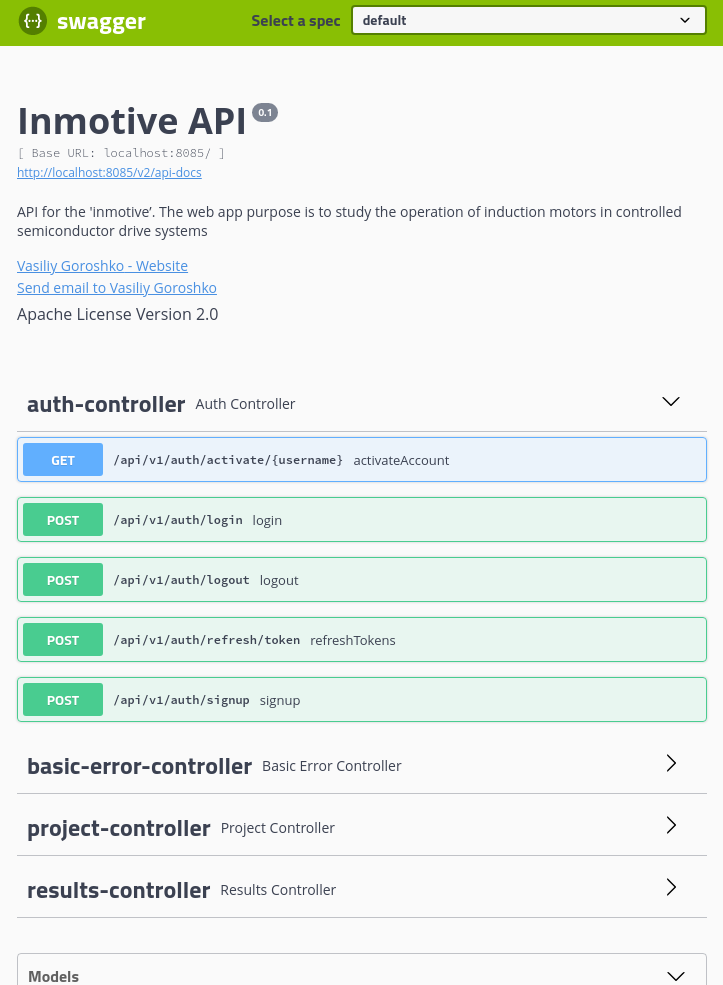

# inmotive-backend
#### _The purpose of the web app 'inmotive' is to study the operation of induction motors in controlled semiconductor drive systems. Backend part._

This server-side application is developed on top of the **Spring Boot**. The authentication process is done by **Spring Security**. Application makes use of **JWT** (JSON Web Tokens) authentication for securing an exposed REST API. **PostgreSQL** is used as database management system. DAO layer is implemented by **Spring Data JPA**. **Swagger** is used to document REST API.

### TODO:
- add different types of power electronics converters
- perform analysis and decomposition of the mathematical model of an induction motor, thereby presenting it in the form of classes
- add classes representing loads with constant power and variable torque
